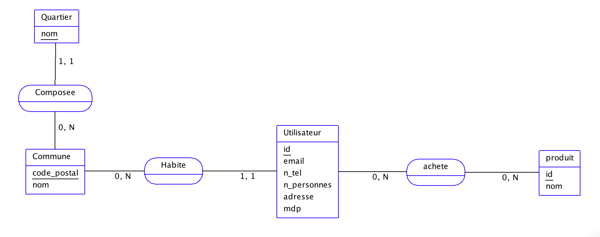

# Projet-Python

> Authors: Aladin HOMSY ([@aladeen57](https://github.com/aladeen57)), Ines CARTALAS ([@carta92](https://github.com/carta92)), Amriitha MYLVAGANAM ([@Amriitha30](https://github.com/Amriitha30)), Louis WOLFERS ([@louiswolfers](https://github.com/louiswolfers)), Julien MARTIN-PRIN ([@Flexiboy](https://github.com/Flexiboy))

This project is made within the Python course in 3rd year of engineering at ESILV.

The goal of this project is to make an application that will help cities manage an eventual total lockdown during the COVID-19 pandemic.

## Entity-association model

